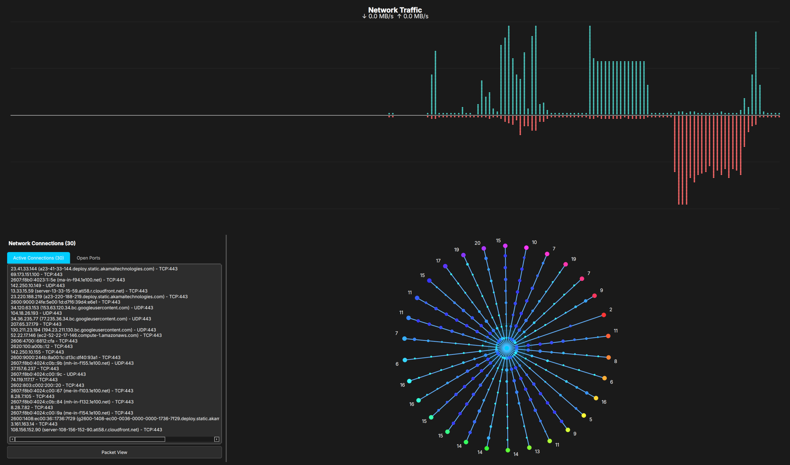

# Network Visualizer

Network Visualizer is a graphical network monitoring and visualization tool built with Python and PyQt6. It allows users to inspect live network traffic, scan for devices on the LAN, and visualize active network connections in real-time.

Features
🌐 Network Traffic Monitoring — Real-time display of active network connections.

🔍 Port Scanning — Detect open ports on discovered LAN devices.

🛰️ LAN Device Discovery — Identify and display devices on the local network.

📍 Traceroute Functionality — Visualize the route packets take to reach external hosts.

🎨 Interactive GUI — Built with PyQt6, featuring real-time widgets and visual elements.

Screenshots

Requirements
Python 3.8+

Dependencies: 
PyQt6
psutil
scapy

Install dependencies with:
pip install -r requirements.txt

Note: On Linux, root privileges may be needed for certain functions like traceroute or port scanning.

License
MIT License